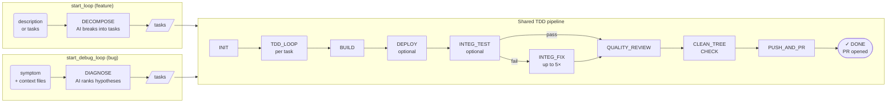
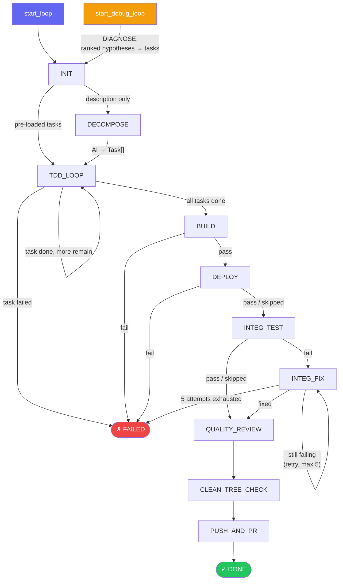
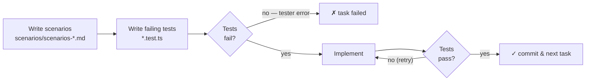

# dev-loop-mcp

An MCP (Model Context Protocol) server that runs an AI-driven TDD development loop. It generalizes the dev-loop state machine to work with any project via a simple config file.

## What it does

Two loop types are available — both share the same TDD pipeline; they differ only in how tasks are produced:



### Full state machine



### Per-task TDD cycle

Each task in `TDD_LOOP` runs this inner cycle (up to 5 coding iterations):



**Phase reference:**
- **INIT**: Creates the git branch
- **DECOMPOSE**: AI converts a description into a `Task[]`
- **DIAGNOSE**: *(debug loop only)* AI reads symptom + context files and produces ranked root-cause hypotheses as a `Task[]`
- **TDD_LOOP**: Per-task: scenarios → failing tests → implementation (up to 5 coding iterations per task)
- **BUILD**: Runs `buildCommand`
- **DEPLOY**: Runs `deployCommand` — skipped if not configured
- **INTEG_TEST**: Runs `integTestCommand` — skipped if not configured
- **INTEG_FIX**: AI diagnoses and fixes integration test failures (up to 5 attempts)
- **QUALITY_REVIEW**: AI reviews the full branch diff and applies quality fixes
- **CLEAN_TREE_CHECK**: Auto-commits any uncommitted files
- **PUSH_AND_PR**: Pushes the branch and opens a GitHub PR

## Installation

```bash
npm install -g dev-loop-mcp
```

Or use via `npx`:

```bash
npx dev-loop-mcp
```

## Configuration

Create `dev-loop.config.json` in your project root:

```json
{
  "buildCommand": "npm run build",
  "testCommand": "npm test",
  "deployCommand": "npm run deploy",
  "integTestCommand": "npm run test:integ",
  "branchPrefix": "claude/",
  "model": "claude-sonnet-4-6"
}
```

All fields are optional. Defaults:
- `buildCommand`: `"npm run build"`
- `testCommand`: `"npm test"`
- `deployCommand`: absent (DEPLOY phase skipped)
- `integTestCommand`: absent (INTEG_TEST phase skipped)
- `branchPrefix`: `"claude/"`
- `model`: `"claude-sonnet-4-6"`

## Environment variables

| Variable | Required | Description |
|---|---|---|
| `ANTHROPIC_API_KEY` | Yes | Your Anthropic API key |
| `DEV_LOOP_ROOT` | No | Project root directory (defaults to `cwd`) |

## MCP setup

Add to your MCP client configuration (e.g., Claude Desktop `claude_desktop_config.json`):

```json
{
  "mcpServers": {
    "dev-loop": {
      "command": "dev-loop-mcp",
      "env": {
        "ANTHROPIC_API_KEY": "sk-ant-...",
        "DEV_LOOP_ROOT": "/path/to/your/project"
      }
    }
  }
}
```

## Available tools

### `start_debug_loop`

Start a debug loop from a symptom description. The AI diagnoses root causes as ranked TDD tasks, then runs the standard TDD pipeline per hypothesis, and opens a PR with a full diagnosis writeup.

```json
{
  "symptom": "read_website returns failure on most real URLs",
  "context_files": ["src/tools/read-website.ts", "src/http/client.ts"]
}
```

**Parameters:**
- `symptom` (required) — natural-language description of the observed bug or failure
- `context_files` (optional) — relative paths to source files the AI should read while diagnosing

The DIAGNOSE step runs before the standard TDD pipeline (see state machine above). The PR body includes the symptom, root causes identified, and what was fixed.

The branch is named `<branchPrefix>debug/<symptom-slug>`.

### `start_loop`

Start a new development loop.

```json
{
  "description": "Add email validation to the user registration flow",
  "branch": "claude/email-validation"
}
```

Or with pre-decomposed tasks:

```json
{
  "tasks": [
    {
      "id": 1,
      "title": "Add email validator function",
      "scope": "src/utils/email.ts",
      "acceptance": "validateEmail returns true for valid emails and false for invalid ones"
    }
  ],
  "branch": "claude/email-validation"
}
```

### `resume_loop`

Resume an interrupted loop:

```json
{}
```

### `loop_status`

Check the current loop status:

```json
{}
```

## Using as a library

```typescript
import { runLoop, loadConfig, RealShellAdapter, AnthropicDevWorker } from "dev-loop-mcp";
import Anthropic from "@anthropic-ai/sdk";

const config = await loadConfig("/path/to/project");
const client = new Anthropic();
const shell = new RealShellAdapter();
const aiWorker = new AnthropicDevWorker(client, config.model, shell);

const finalState = await runLoop(initialState, {
  shell,
  aiWorker,
  stateFilePath: "/path/to/project/.loop-state.json",
  repoRoot: "/path/to/project",
  config,
});
```
